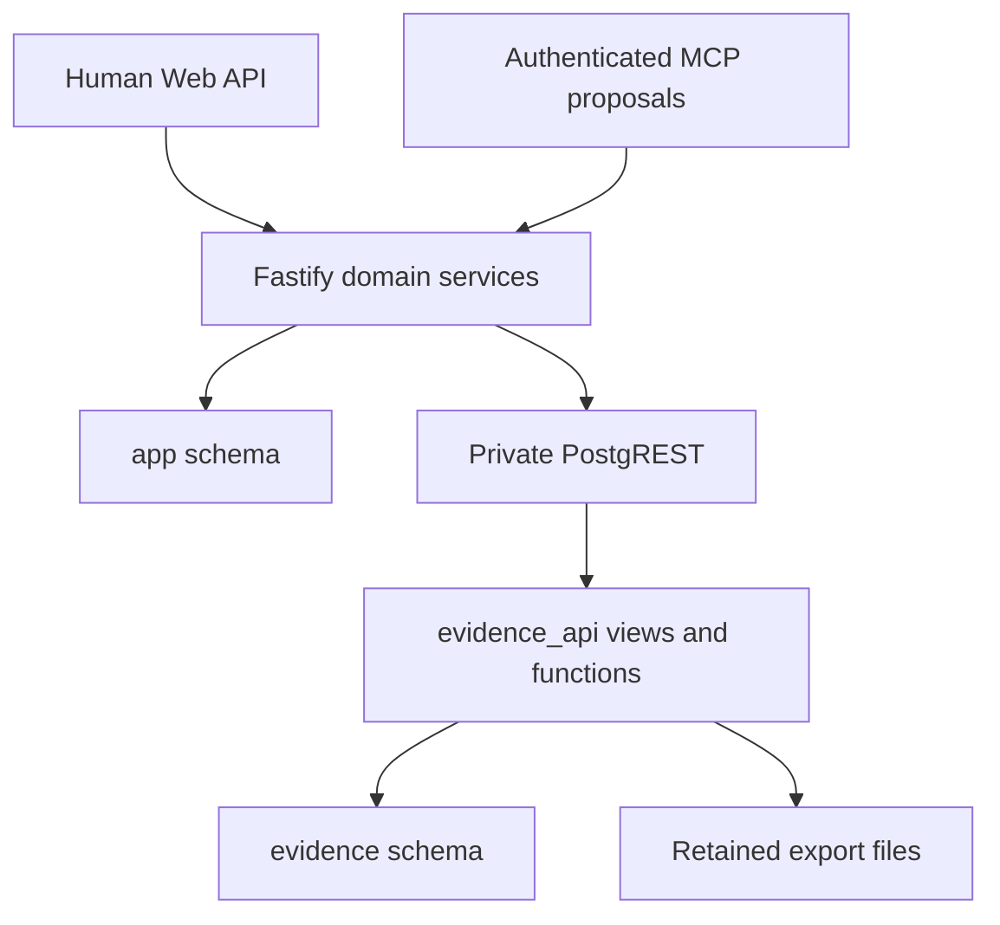

# V1 Persistence / Database Architecture

**Status:** Design accepted; project/revision API and Web autosave implemented, domain SQL schema supplied as Goose migrations. Other workflow APIs remain pending.
**Version:** 1.0  
**Date:** 2026-10-01  
**Canonical destination:** `docs/designs/persistence-database-architecture.md`  
**Requirements:** [Requirements V1.0](../01-requirements.md), REQ-001 through REQ-159; unchanged.  
**Inspected repository:** `Ton-uhsu/PLC-LadderMCP`, commit `c4c307f50e144248f20a3106a927c0a7d28bfabd`.  
**Related designs:** [Overview](../03-solution-design.md), [tech stack](tech-stack.md), [deployment](deployment-architecture.md), [authentication](authentication-access-control.md).

## 1. Purpose and boundaries

PostgreSQL is authoritative durable storage for V1 projects, canonical Ladder IR revisions, semantic proposals, Human Review, validation/compile history, export checkpoints/files, POC evidence and required audit history. Vendor interchange files are derived artifacts, never the authoritative Ladder model.

One Fastify application owns domain operations and accesses PostgreSQL through Kysely + pg. PostgREST provides a restricted evidence and retained-artifact data path; it cannot mutate application project heads or approve/apply AI proposals. No additional domain microservices, heavy ORM, multi-user account system or SaaS tenancy model is introduced.

This document defines logical tables, constraints, invariants and transaction boundaries. It does not create SQL migrations, modify application code, schedule backups, establish a roadmap or settle unproven IDE compatibility. Executable DDL now lives in `db/migrations/00001_*.sql` through `00004_*.sql`, managed exclusively by Goose. See the [local persistence guide](../guides/local-postgresql-persistence.md) for Up/Down and existing-database adoption. The schema does not by itself implement domain workflow APIs, authorization, Apply transactions or PostgREST ingestion.

## 2. Confirmed foundational decisions

| Decision | Confirmed choice | Consequence |
| --- | --- | --- |
| D1: AI Apply history | Every successful logic-affecting Apply creates a new immutable project revision | Never overwrite historical IR; one successful Apply may include several approved networks |
| D2: Revision representation | Full canonical IR snapshot in JSONB for every revision | Historical reads/restore/compile do not depend on replaying deltas |
| D3: Manual autosave | Every successful save of changed state creates an immutable revision | Frontend batches short edit bursts; an uncompiled or semantically invalid manual draft may be saved |
| D4: Metadata history | Metadata changes also create revisions; project revision and logic hash are separate | Exact snapshots remain recoverable without automatically invalidating logic compile/proposals |
| D5: Review durability | Persist batches, proposals, revisions, review events, feedback and validation in PostgreSQL | Review survives ordinary restart; interrupted work must be reconciled before proceeding |
| D6: Apply transaction | Lock the project, verify current approvals/dependencies, integration-validate, and commit all changes atomically | No partial head/revision/review/audit publication |

The remaining detailed choices below are technical recommendations derived from these decisions and the frozen requirements. They do not add new product requirements.

## 3. Requirement traceability and baseline findings

| Requirements | Persistence implications |
| --- | --- |
| REQ-016, 023, 033, 041 | Independent projects, recoverable history, restart durability and PostgreSQL authority |
| REQ-038–040, 133–134 | Autosaved manual revisions, session undo/redo, explicit Compile and logic-based invalidation |
| REQ-046–064 | Per-network review, feedback, immutable proposal lineage, locked approvals and partial Apply |
| REQ-065–079 | Overlap protection, non-overlapping batches, dependency-aware stale checks, integration results, cancellation/retry and audit |
| REQ-089–094 | Direction-specific compatibility, actual fixture bytes, append-only POC runs and full associated evidence |
| REQ-095–111 | Canonical topology, stable identities, vendor extensions/source mapping and schema version |
| REQ-112–136 | Stable diagnostic codes/locations, validation severity and revision-pinned compile history |
| REQ-137–140, 150–158 | Ordered typed batches, atomic construction, mandatory review, base revision, idempotency and operation dependencies |
| REQ-141–149 | Revision-specific export checkpoint deduplication, actual retained files, targets, notes and current compile/adapter gates |
| REQ-022, 159 | Single-admin design, separate human/machine authentication and actor traceability |

### 3.1 Contradictions and superseded assumptions

1. REQ-023 permits process-local pending review but does not require it. Durable review is compatible with that allowance and preserves REQ-062/079 history. No requirement amendment is needed.
2. REQ-143 also names PostgreSQL/PostgREST for retained export artifacts. The evidence-only wording in existing design summaries is incomplete: restricted export artifact retrieval belongs in that path too. Fastify remains responsible for producing exports and enforcing gates.
3. `services/mcp-server/src/project.ts` currently overwrites filesystem JSON, uses a process-global current project, maintains bounded in-memory undo/history, and deletes rejected proposals. This cannot be the V1 durable history implementation.
4. Current stale checks compare the full JSON serialization. They incorrectly treat unrelated/metadata changes as universally stale and lack explicit base revision/dependency evidence.
5. Current approval commits immediately rather than separating network approval, review-round completion and Apply. Current proposal state has no durable per-network rework lineage.
6. Current export functions validate/serialize without durable explicit compile runs, exact revision references, checkpoint deduplication or retained generated bytes.
7. Current capability evidence in Markdown/TypeScript is useful research, not the required PostgreSQL fixture/run store. Historical evidence must retain its actual scope; compilation alone is not IDE verification.
8. The older research/contracts describe generic instruction nodes and legacy network comments. Persist the accepted versioned canonical IR; do not freeze the old v0.2 shapes as the final V1 schema or let persistence redefine the IR contract.

The target stack remains the accepted documentation baseline. The inspected implementation predates it; this design does not initiate a broad migration.

## 4. Ownership and database layout

Use three PostgreSQL schemas inside each environment database:

| Schema | Owner and access |
| --- | --- |
| `app` | Fastify domain/repository layer: project, revision, batch, review, validation, compile, export and audit tables |
| `evidence` | POC fixture/run/artifact/compatibility tables, written by authenticated evidence workflows |
| `evidence_api` | Explicit views/functions exposed through PostgREST for evidence and retained-artifact access |

Use distinct staging and production databases, credentials and persistent storage identities. No tenant column is necessary. The application runtime role has limited domain privileges; migrations use a separate owner role. PostgREST has no grant on project head/review mutation tables.

The browser calls authenticated Fastify routes. Fastify may proxy the private PostgREST service for evidence/artifact retrieval, preserving the required data path without exposing service credentials to JavaScript. An authenticated POC tool may use the narrowly scoped evidence ingestion surface. No anonymous project/file access is permitted.

## 5. Common types, identities and immutability

- Entity identifiers: UUID generated by the backend. Project revision numbers and per-batch/per-proposal revision numbers: positive BIGINT, monotonically increasing within their owner. APIs encode BIGINT as decimal strings to avoid JavaScript precision loss.
- Timestamps: `timestamptz`, stored/interpreted in UTC; UI localization is presentation only.
- IR, typed operation payloads, dependency manifests and diagnostic context: JSONB with explicit payload/schema versions. Relational columns/FKs hold lifecycle identities and query-critical fields.
- Exact interchange/output files: BYTEA, with filename, media type, encoding, byte length and SHA-256. Store bytes after final BOM/encoding/newline serialization, not an intermediate JavaScript string.
- No relational contact/coil table in V1. The canonical topology lives once in each revision snapshot. Optional derived network/dependency indexes are disposable projections, not a second source of truth.
- Immutable tables reject UPDATE/DELETE through database privileges/triggers after insertion. Mutable aggregate heads/projections are distinguished explicitly below. Terminal validation/compile/POC run outputs are sealed; updating an in-progress run to completion is allowed, rewriting a completed result is not.
- Actor context is recorded as `actor_type` (`human`, `mcp`, `system`), stable non-secret `actor_key`, optional display identity/client identifier and request/correlation ID. A principal table and account foreign key are unnecessary for one administrator.
- Do not cascade-delete revisions, reviews, events or artifacts. No new user-facing deletion/purge workflow is proposed.

## 6. Project and revision model

### 6.1 Tables

| Table | Important fields | Constraints and role |
| --- | --- | --- |
| `app.projects` | `id`, `current_revision_id` nullable during reviewed creation, timestamps | Mutable identity/head only; head FK must belong to the same project |
| `app.project_revisions` | `id`, `project_id`, `revision_no`, `parent_revision_id`, `origin`, `restored_from_revision_id`, `ir_schema_version`, `ir_snapshot`, `content_hash`, `logic_hash`, `logic_hash_version`, `plc_family`, `plc_model`, `default_export_target`, `created_at`, actor/request context | UNIQUE `(project_id, revision_no)`; immutable; parent/restore FKs belong to same project |

`ir_snapshot` contains canonical project metadata/topology/vendor extensions required by the IR contract. PLC fields extracted into relational columns must agree with the snapshot. `default_export_target` is revisioned application configuration if not part of the canonical IR; include it in the revision envelope content hash. It is not an execution-semantic change.

`origin` distinguishes initial creation, manual autosave, AI Apply, human import, restore and metadata edit. AI-created projects begin as a reserved project identity with no authoritative head; proposed initial IR is reviewed, then initial Apply creates the first revision. Human-created empty drafts may create an initial revision without semantic compile success. AI import/load/create tools always remain proposal-producing tools.

### 6.2 Hashes and revision semantics

`content_hash` hashes deterministic canonical serialization of the full revision envelope, excluding generated database timestamps/IDs. Define canonical key ordering and number encoding once; do not hash raw `JSON.stringify()` with arbitrary property insertion order.

`logic_hash` hashes the execution/validation-relevant IR projection: PLC context, topology, deterministic execution order, instructions, typed operands, mappings, semantic labels/references, vendor semantic payloads and stable identities required for diagnostic mapping. Exclude purely descriptive names/comments and default export target. Symbol mappings that affect behavior are not descriptive metadata. Preserve branch and network order; never sort execution arrays to normalize a hash.

Hash projection is versioned and tested against the IR contract. Unknown vendor payload fields are conservatively treated as relevant. Different hash algorithm/projection versions are not assumed equivalent.

For metadata-only descendants, unchanged `logic_hash` can preserve compile eligibility; full revision identity still changes. For stale proposals, hashes are an optimization plus evidence, not a substitute for comparing relevant networks/dependencies.

No-op saves with identical revision content return the existing head without creating a new revision. Same-key request retries also return their original result. Repeated intentional changes back to an old state create a new revision; content hash is not a unique history key.

### 6.3 Manual drafts and restore

The current saved revision may be a draft with semantic errors; saving is not compiling. Autosave checks authentication, structural IR validity/schema and expected base revision, but does not require full PLC semantic validation. Temporary malformed editor interactions stay local until they can be represented by the accepted draft IR schema.

Manual saves use the same project-head lock as Apply. Concurrent browser tabs cannot silently overwrite a newer revision. Their conflict result includes the current revision for explicit reload/reconciliation.

Undo/redo within the editor uses session-local action history. Any resulting saved changed state creates a new immutable revision. Durable restore copies historical state into a new revision, records `restored_from_revision_id`, and leaves all old revision numbers/head transitions intact. If restored logic changes relative to the immediate previous head, explicit Compile is required again; do not revive a pre-change compile merely because a historic hash recurs.

## 7. Semantic batches, network proposals and Human Review

### 7.1 Tables and boundaries

| Table | Important fields | Mutability and constraints |
| --- | --- | --- |
| `app.change_batches` | `id`, `project_id`, `original_prompt`, `retry_of_batch_id`, `current_batch_revision_id`, `cancelled_at`, actor/timestamps | Intent/lineage immutable; active pointers/cancellation projection mutable; retry FK same project |
| `app.batch_revisions` | `id`, `batch_id`, `revision_no`, `parent_batch_revision_id`, `base_project_revision_id`, `plc_context`, `operations`, `dependency_manifest`, `candidate_ir`, `candidate_hash`, `validation_run_id`, `submission_request_id`, repair/rework context | Immutable; UNIQUE `(batch_id, revision_no)`; exact planned base retained forever; candidate may be absent on construction failure |
| `app.network_proposals` | `id`, `batch_id`, `network_id`, `current_proposal_revision_id`, `current_state`, timestamps | Stable proposal identity and rebuildable lifecycle projection; UNIQUE `(batch_id, network_id)` |
| `app.network_proposal_revisions` | `id`, `proposal_id`, `revision_no`, `parent_proposal_revision_id`, `origin_batch_revision_id`, `before_network`, `after_network`, `change_kind`, `order_change`, `diff`, `summary`, `dependencies`, `scope_warning` | Immutable; UNIQUE `(proposal_id, revision_no)`; snapshots nullable for addition/deletion; move uses explicit order change |
| `app.batch_revision_items` | `batch_revision_id`, `proposal_id`, `proposal_revision_id` | Immutable membership; one selected revision per proposal in a batch revision; permits carrying unchanged approved context forward |
| `app.review_rounds` | `id`, `batch_id`, `round_no`, `batch_revision_id`, `opened_at`, `closed_at` | UNIQUE `(batch_id, round_no)`; close-only lifecycle projection |
| `app.review_round_items` | `round_id`, `proposal_revision_id`, `role` | Immutable actionable/context membership; previously approved/applied items may appear as read-only context |
| `app.review_events` | `id`, `round_id`, `proposal_revision_id`, `event_type`, `feedback`, actor/time/request | Append-only decisions; approval/rejection always pins the exact reviewed content |
| `app.network_review_locks` | `project_id`, `network_id`, `batch_id`, `proposal_id` | Mutable reservation; UNIQUE `(project_id, network_id)` prevents overlapping unresolved batches |

Stable network identity is distinct from execution position. `network_id` uses the canonical IR identity type (currently a number); a reorder never changes identity. Do not reinterpret numeric IDs as sorted execution order. Node IDs remain embedded in IR/diffs/diagnostic locations.

Operations are ordered JSONB typed records containing stable `operationId`, type, payload and explicit dependency references. Validate unique IDs, supported schemas, dependency existence and deterministic order before proposal construction. Store construction diagnostics against operation IDs, not only array indexes. A separate operations table is unnecessary until actual query needs justify it.

### 7.2 Submission and rework

Construct proposals on a cloned base snapshot. No change to the authoritative head occurs. Publish a revision as reviewable only after whole-batch validation succeeds. Failed constructions/validation retain submission, diagnostics and audit but never publish an approvable partial set.

Acquire review reservations transactionally when publishing an eligible batch revision. Initial batches reserve changed networks; rejected/rework proposals retain their reservation. Applied/cancelled proposals release it. An approved proposal remains reserved until Apply or cancellation. This allows unrelated networks to proceed concurrently.

Rework produces a new batch revision under the same batch and new revisions only for rejected/rework networks. Unchanged approved/applied network revisions remain linked as locked context. Old proposal revisions stay readable and non-actionable. An approval is never silently transferred to modified content.

Persist rejection feedback with the exact rejected proposal revision in `review_events`; rework input records the feedback event IDs it used. No separate feedback table is required for a short rejection message.

Count repair attempts against the relevant failed batch-revision repair chain; retain each attempt/result, enforce REQ-051's maximum three automatic repair attempts, and distinguish subsequent user-triggered action from automatic retry.

### 7.3 Lifecycle rules

- Validation failure is non-approvable. Successful full validation opens a review round.
- Only latest active proposal revisions in that round may receive a decision. Approve records/locks content; it does not Apply.
- A round reaches its Apply step after all its actionable items have a human decision. Approved items may Apply together while rejected items remain available for rework.
- A failed integration Apply does not mark any approved item Applied. Record `INTEGRATION_CONFLICT`; resolve/revalidate against current context, and require fresh review when proposed content changes.
- Batch aggregate status is derived from per-network states and cancellation, not independently user-assigned. Empty construction-failed batches derive status from their construction/validation result.
- Rejected items awaiting rework remain unresolved; completed means no pending/rework/stale/conflict work remains. Historical applied items remain Applied even if the user cancels the remaining batch.
- Cancellation is permanent. Preserve intent/revisions/feedback/results, release remaining locks and prohibit future Apply from that batch. Retry creates a new batch with `retry_of_batch_id`, reads the current project head and carries intent/feedback references, not old candidate state.
- Restart does not remove reservations or approvals. Database transactions commit or rollback; interrupted processing records require reconciliation before reuse.

Events for cancel, retry, rework, stale and lifecycle transitions are retained in `audit_events`; review decisions additionally use the typed review table. Current state fields are query projections updated atomically with their source events.

## 8. Validation, Apply and concurrency

### 8.1 Validation records

| Table | Important fields |
| --- | --- |
| `app.validation_runs` | `id`, `kind` (`proposal`, `integration`, `compile`, `adapter`), exact `project_revision_id`/`batch_revision_id`/`export_event_id` as applicable, `input_hash`, candidate/approval references, validator/profile/schema versions, status, start/finish, severity counts |
| `app.validation_diagnostics` | `id`, `validation_run_id`, stable `code`, `severity`, `message`, `operation_id`, `network_id`, `node_id`, `device`, `path`, `related_locations`, structured context |

Each run type has a constrained owner/reference shape. An integration run pins the latest base revision and selected proposal revisions; its candidate input hash proves what was validated. Compile input is always a saved project revision, not an untracked browser draft. Diagnostics are append-only after completion; counts/status agree with rows at sealing. INFO, WARNING and ERROR are distinct; warnings do not become generic blocking errors.

### 8.2 Apply records

| Table | Important fields | Constraint |
| --- | --- | --- |
| `app.apply_events` | `id`, `project_id`, `batch_id`, `review_round_id`, `from_revision_id`, `to_revision_id` nullable on failure, `integration_validation_run_id`, `result`, request/actor/time | SUCCESS requires output revision; failed/no-op attempts cannot claim a new applied revision |
| `app.apply_event_items` | `apply_event_id`, `proposal_revision_id`, `approval_event_id` | Exact approval/content lineage; a proposal revision may belong to at most one successful Apply |

### 8.3 Apply transaction

1. Authenticate as the human surface; AI tools cannot invoke approval/Apply mutations.
2. Begin transaction and claim the Apply request idempotency record.
3. Lock project row, then batch/round and proposal projection rows in stable identifier order. All manual saves/restores and relevant review/cancel mutations follow the same lock order.
4. Verify current round, exact latest approvals, network reservations, cancellation status and whether the request has already succeeded.
5. Read the current authoritative revision. Compare relevant network state, mappings, device/label dependencies and execution-order effects against each proposal's original base.
6. If only unrelated changes occurred, merge approved network changes onto the current revision and revalidate; never replace the latest whole project with the old candidate snapshot. Preserve newer unrelated metadata. Metadata patches operate on touched fields with explicit conflicts rather than replacing an entire network's comments blindly.
7. Relevant changes cause STALE/conflict; no silent regeneration. An explicit revalidation/regeneration path may continue, preserving history; changed content creates new proposal revisions and fresh review.
8. Run full integration validation on the merged latest project. For V1 this is bounded local deterministic work inside the transaction; no external AI/IDE/network calls while holding locks.
9. On success, insert exactly one immutable revision for changed content, SUCCESS Apply event/items, state transitions, audit, head update and reservation releases in the same transaction.
10. Commit before acknowledging success. On a validation/stale failure, commit only the failed attempt/diagnostics/lifecycle audit and no authoritative revision/head change. Unexpected database errors roll back everything; operational logs correlate the request.

Use row locks with READ COMMITTED and explicit locked-head rechecks; SERIALIZABLE is unnecessary for every request. Retry database deadlocks/serialization errors only within bounded safe request handling. Idempotency prevents duplicate effects after an uncertain response.

Dependency manifests include relevant read/write devices, overlapping register ranges, mappings, referenced labels, network fingerprints and order dependencies. A full-project `logic_hash` mismatch does not automatically invalidate every proposal (REQ-071). If dependency analysis cannot establish relevance safely, report explicit stale/uncertain context rather than silently applying.

An Apply may be a no-op after safe reconciliation; retain an event pointing to the unchanged state without manufacturing a duplicate revision. Approval-only clicks never create project revisions.

## 9. Compile model and exact traceability

| Table | Important fields | Constraint |
| --- | --- | --- |
| `app.compile_runs` | `id`, `project_id`, `project_revision_id`, `validation_run_id`, `logic_hash`, `plc_family`, `plc_model`, capability/validator/compiler version identifiers, status, timestamps, actor/request | Each explicit Compile creates a run; one-to-one compile validation run; all revision FKs same project |

Compile diagnostics are exposed as `compile_diagnostics` through a view over the run's `validation_diagnostics`; do not duplicate identical diagnostic rows in two tables. Proposal and integration validation are not implicitly relabeled as explicit Compile history.

Capture a saved revision at Compile start. A later edit does not alter that run's input or result. Completion may produce PASS for a historical revision while the current head remains Compile Required.

Successful compile eligibility for the head requires compatible validation context and a successful run for the current logic generation. Logic-affecting head changes immediately invalidate eligibility. Repeating a historical logic hash after intervening logic changes requires a new Compile.

For a chain of metadata-only descendants, reuse is allowed only when logic hash/projection version, stable diagnostic identities, PLC/profile/validator/compiler context and required metadata checks remain equivalent. Export records both the exact exported revision and original `compile_run_id`; their revision IDs may differ only under this explicit metadata-equivalence rule. Do not rewrite the compile run to pretend it compiled the newer snapshot. Adapter checks always run on the exact exported snapshot. Metadata requiring recompilation invalidates reuse.

Derive eligibility from revisions/runs/context rather than storing an independently editable `compiled=true`. An indexed cached eligibility projection is optional and rebuildable.

## 10. Export versions, events and actual files

| Table | Important fields | Constraint |
| --- | --- | --- |
| `app.export_versions` | `id`, `project_id`, `project_revision_id`, `created_at` | UNIQUE `(project_id, project_revision_id)`; one logical checkpoint across all targets |
| `app.export_events` | `id`, `project_id`, `project_revision_id`, `export_version_id`, `compile_run_id`, `adapter_validation_run_id`, target vendor/IDE/format, PLC context, adapter/build version, optional `note`, status, timestamps, actor/request | SUCCESS requires checkpoint, passing gates and retained artifact; failures need not create a checkpoint |
| `app.export_artifacts` | `id`, `export_event_id`, `project_revision_id`, target metadata, `filename`, `media_type`, `encoding`, `content` BYTEA, `byte_length`, `sha256`, `created_at` | Immutable exact bytes; multiple files per event allowed; target/revision agrees with event |

A new intentional export from the same revision creates a new event and artifacts but references the existing checkpoint, even when the target differs. A same-key transport retry returns the existing event/artifacts. Do not deduplicate checkpoint identity by logic hash or target: metadata revisions have distinct exact snapshots under REQ-142.

Store the optional note on each export event so repeated exports do not rewrite earlier notes. The version UI may show its first successful event's note plus later event notes.

Export sequence:

1. Capture current revision, resolve explicit/default target and check successful current compile eligibility.
2. Retain a started export event, run selected adapter compatibility checks on that exact snapshot and serialize final bytes. Run against immutable captured data; no long DB lock during serialization.
3. Finalize transaction with project head lock/recheck. If the current revision changed, mark the attempt superseded/failed and do not publish it as a successful current-project export. User-triggered historical artifact download never reruns Export.
4. On passing gates, insert-or-reference the unique checkpoint, insert actual file bytes/metadata and finalize SUCCESS event/audit atomically.
5. Serve/download only after commit. File-persistence failure means export did not succeed; generation alone is insufficient.

PostgREST exposes authenticated artifact metadata and a restricted binary download function selecting BYTEA with the correct media type; do not send BYTEA as a hex JSON field for browser downloads. Fastify proxies the retained artifact route and supplies safe download filename headers. The implementation must verify exact round-trip bytes, including GX Works2 UTF-16LE BOM and SamSoar UTF-8 BOM/newlines.

## 11. POC fixtures, runs and compatibility evidence

| Table | Important fields | Invariant |
| --- | --- | --- |
| `evidence.poc_fixtures` | `id`, stable fixture key/name, feature/instruction classification, common/vendor-specific class, descriptive metadata | Fixture identity; not a mutable historical result |
| `evidence.poc_fixture_files` | `id`, `fixture_id`, fixture file version, vendor/IDE/version, format, filename/encoding/media type, content BYTEA, byte length/checksum | Actual immutable source fixture bytes; replace by adding a file version |
| `evidence.poc_runs` | `id`, `fixture_id`, `source_fixture_file_id`, verification direction, target IDE/version, PLC, adapter/build/version identifiers, status, timestamps, actor/request | New run per intentional attempt/regression; completed runs never overwritten |
| `evidence.poc_run_artifacts` | `id`, `run_id`, role, optional ordinal, bytes or versioned IR JSONB, format/encoding/checksum metadata | Roles include original source, generated file, expected IR, actual IR; check exactly one payload representation |
| `evidence.compatibility_results` | `id`, `run_id`, feature/instruction/operand form, direction, PASS/FAIL/PARTIAL/N_A, diagnostics/metadata fidelity, evidence artifact references | Append-only observations; import/export/round-trip recorded separately |

Run artifact associations pin exact fixture/file versions. Original source and generated files must be retrievable from PostgreSQL; a local path alone is insufficient. Expected/actual IR includes schema version, hash and relevant source mapping. A run can be sealed as construction/import failure with unavailable generated/actual roles explicitly identified; a successful round trip requires all required evidence roles. Never fabricate missing evidence to satisfy a row count.

Use constrained PostgREST ingestion functions for run creation/artifact association/finalization. They enforce role grants, append-only results and complete evidence before success. A latest-results view is a projection over run history with deterministic timestamp/ID ordering and target/version/operand scope. It must not turn one verified operand form into blanket instruction compatibility.

Existing repository fixtures/tests remain useful reproducible code assets, but production evidence authority is PostgreSQL. Importing legacy assertions without actual files creates labelled legacy observations, not newly completed round-trip runs. SamSoar and GX Works2 import/export support remains Pending POC at the scope specified by the frozen requirements.

## 12. Audit, idempotency and authentication-related durable data

| Table | Important fields | Purpose |
| --- | --- | --- |
| `app.audit_events` | `id`, event type, actor context, correlation ID, project/revision/batch/proposal/round/validation/compile/export references as applicable, typed JSONB detail, timestamp | Append-only change/security trace; written with the domain mutation |
| `app.request_deduplication` | `id`, non-secret caller identity, operation scope, idempotency key, canonical request hash, result entity/reference, result status, timestamps | UNIQUE `(caller_key, operation_scope, idempotency_key)`; durable request identity |

Store original prompt/IR/diffs in their owning records; audit points to them rather than copying complete snapshots into every event. Events cover submit/repair/rework/review/apply/stale/conflict/cancel/retry/restore/export and relevant auth outcomes. Logs are operational and are not a replacement for audit history.

Same idempotency key and same payload returns the existing result. Same key with a different payload returns a structured conflict. Idempotency scope distinguishes initial batch submission from rework under the same batch. Failed/rejected requests have deterministic recorded outcomes; corrected payloads use a new request key. Apply/manual autosave/export may use the same mechanism to avoid duplicate state/events after retries. Do not expire V1 submission deduplication while its domain lineage remains retained.

V1 does not require users, password-hash, API-key or persistent session tables. Human credentials, MCP token and session signing secret remain separate deployment secrets. A stable signing secret survives pod restarts. Durable auth-related state is limited to non-secret actor/auth audit records; do not store passwords, bearer tokens, session tokens, signing secrets or full Authorization headers. No account/RBAC/rotation UI is added.

## 13. Constraints, indexes and operational durability

Required relationships use FKs and same-owner composite keys where appropriate: project revision belongs to project, batch revision belongs to batch/project, proposal revision belongs to proposal/batch, review decision belongs to exact round/item, export artifact belongs to exact event/revision. Nullable references have type-specific CHECK constraints; avoid unconstrained polymorphic IDs as the sole integrity mechanism.

Important indexes:

- UNIQUE project revision numbers, batch revision numbers, proposal revision numbers and round numbers within their owner.
- UNIQUE export checkpoint per project revision and request idempotency scope/key.
- UNIQUE network reservation per project/network and one successful Apply item per proposal revision (enforce through a successful-item constraint/projection maintained transactionally).
- History lists on `(project_id, created_at, id)` for revisions/events/compiles/exports and `(batch_id, revision_no)` for batch history.
- Diagnostic lookup on validation run/severity and network/node identity.
- Evidence lookup on fixture/target/direction/run time and compatibility feature/operand form.
- Index FK columns used in joins and conflict checks. No blanket JSONB GIN indexing or partitioning in V1 without observed need.

Use cursor pagination for histories and separate metadata listing from binary downloads. Do not load every artifact into a project response. A bounded pg connection pool is shared by Kysely; internal PostgREST uses its own restricted pool.

PostgreSQL uses durable persistent storage per the deployment design. Normal transactions use ordinary durable commits; no unlogged authoritative tables or async success before commit. Filesystem paths in pods are temporary only. History is not disaster recovery; automated scheduled backups remain deferred under REQ-035.

On startup/recovery, reconcile STARTED validation/compile/export/POC records whose work was interrupted. Seal them as interrupted with audit; a new intentional run gets a new record. Never infer success from partial artifact presence. Resume pending review from committed state; reserve/lock projections are checked against history.

IR schema upgrades create new current revision state through explicit migration provenance while preserving old snapshots/schema versions. Historical payloads must remain readable through version-aware readers/migrations; never rewrite all history to pretend it originally used the latest schema.

## 14. Verification scenarios for implementation

These are design acceptance checks, not a roadmap or new product requirements.

| Scenario | Expected evidence |
| --- | --- |
| Apply multiple approved networks | One new immutable revision and complete Apply/approval lineage |
| Failure after revision insert before head update | Transaction rollback; no successful partial Apply |
| Lost response then same-key retry | Same revision/event/result, no duplicate effects |
| Concurrent manual save and Apply | Serialized head change; latest integration checks, no lost update |
| Non-overlapping parallel batches | Unrelated change can revalidate/continue; original base remains traceable |
| Relevant mapping/order/device change | STALE or integration conflict; no silent regeneration |
| Approve then rework rejected sibling | Approved payload untouched; rejected item gains a new revision with feedback lineage |
| Reject/cancel/restart | Durable history remains; cancelled batch cannot reopen/Apply |
| Manual invalid draft | Save succeeds if representable; Compile fails; Export blocked |
| Metadata-only revision | Exact snapshot changes; eligible compile reuse has explicit equivalent context |
| Logic changes back to old hash | New revision; Compile Required until explicit Compile |
| Compile during edit | Run stays pinned to captured revision; current head eligibility correctly derived |
| Same revision, repeat/different-target exports | One checkpoint, multiple events/files with exact targets |
| Artifact retrieval after adapter upgrade | Byte-for-byte original file, no regeneration |
| Export persistence failure/head change | No successful checkpoint/event publication for that attempt |
| POC rerun changes PASS to FAIL | Two retained runs; each pins source/generated/expected/actual evidence |
| Unauthorized PostgREST/MCP action | Protected data inaccessible; no project head mutation through evidence APIs |

## 15. Alternatives and implementation readiness

Full snapshots are chosen over delta-only replay for simple exact historical reads and traceability. Revisioned manual autosave is chosen over a separate mutable draft table so Compile and AI planning share one durable state identity. Separate typed events/projections are chosen over one generic event-sourcing engine; audit supports reconstruction of lifecycle without making IR depend on operation replay.

BYTEA is the V1 artifact recommendation because actual files must live in PostgreSQL and the expected fixture/export workload is small. External object storage, binary deduplication, partitioning and relational node storage are deferred until measured needs justify them. Kysely + pg suffices; no ORM entity lifecycle is needed.

The six foundational decisions are resolved. No blocking product question remains for this design. Implementation must finalize concrete SQL trigger/function syntax, accepted draft IR schema, deterministic hash projection and private PostgREST binary route using the installed package versions. These are engineering details verified by the scenarios above, not another requirements-grilling round.

This document is linked from the overview/index as part of the same documentation change. The Requirements V1.0 document remains untouched. Existing application code is the migration baseline, not an implementation of this design. Source changes and migrations begin only under a subsequent implementation instruction.
